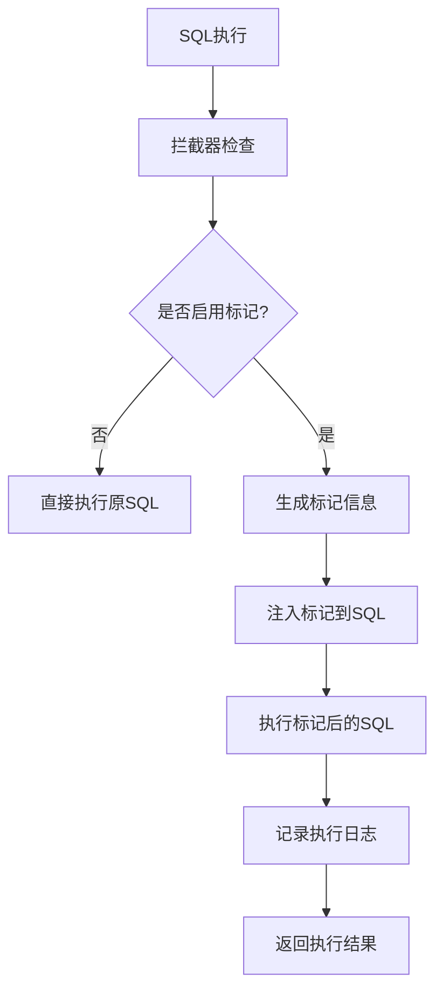

# aione-sqlmarking

[](https://opensource.org/licenses/Apache-2.0)
[](https://www.oracle.com/java/)
[](https://spring.io/projects/spring-boot)
[](https://baomidou.com/)

一个轻量级的 MyBatis SQL 染色插件，专为 Spring Boot 项目设计，用于在 SQL 语句中注入追踪标记信息，方便调用源和上下文的追踪。

## ✨ 核心特性

- **🚀 轻量高效**：对业务代码零侵入，性能影响极小
- **🔍 全面支持**：支持 SELECT、INSERT、UPDATE、DELETE 等所有 SQL 操作
- **📊 智能标记**：自动为 SQL 语句添加追踪标记，不影响执行计划
- **🔗 分布式追踪**：内置 PFinderId、TraceId，支持分布式系统链路追踪
- **⚙️ 灵活配置**：支持细粒度的配置控制，可按 SQL 类型启用/禁用
- **🛡️ 异常安全**：标记失败时自动降级，确保业务不受影响
- **📝 详细日志**：提供丰富的调试信息和执行统计

## 🎯 应用场景

- **性能监控**：追踪慢 SQL 的调用源头
- **问题排查**：快速定位 SQL 执行的业务上下文
- **链路追踪**：在分布式系统中追踪 SQL 调用链路
- **审计日志**：记录 SQL 操作的详细信息
- **开发调试**：在开发环境中快速定位 SQL 来源

## 📦 快速开始

### 1. 添加依赖

```xml
<dependency>
    <groupId>org.ai-one</groupId>
    <artifactId>aione-sqlmarking</artifactId>
    <version>[使用仓库最新版本]</version>
    <!-- https://central.sonatype.com/artifact/org.ai-one/aione-plugin-sqlmarking -->
</dependency>
```

### 2. 配置文件

在 application.yml 中添加配置：

```yaml
# SQL标记配置
mybatis:
  sql-marking:
    enabled: true              # 启用SQL标记功能
    mark-select: true          # 标记SELECT语句
    mark-insert: true          # 标记INSERT语句
    mark-update: true          # 标记UPDATE语句
    mark-delete: true          # 标记DELETE语句
    debug-enabled: true        # 启用调试模式
    verbose-logging: true      # 详细日志记录

# 日志配置（可选）
logging:
  level:
    org.aione.plugin.sqlmarking: DEBUG
```

### 3. 配置

需要在SpringBoot 启动入口增加包扫描路径：

```java
@SpringBootApplication(scanBasePackages = {"org.aione"})
```
插件会自动配置并注册到 MyBatis 拦截器链中，无需额外代码。


## 🔧 详细配置

### 配置参数说明

| 参数 | 类型 | 默认值 | 说明 |
|------|------|--------|------|
| enabled | boolean | true | 是否启用SQL标记功能 |
| mark-select | boolean | true | 是否标记SELECT语句 |
| mark-insert | boolean | true | 是否标记INSERT语句 |
| mark-update | boolean | true | 是否标记UPDATE语句 |
| mark-delete | boolean | true | 是否标记DELETE语句 |
| debug-enabled | boolean | false | 是否启用调试模式 |
| verbose-logging | boolean | false | 是否启用详细日志 |
| mark-prefix | String | "/* MARKED " | 标记前缀 |
| mark-suffix | String | " END_MARKED */" | 标记后缀 |
| include-full-info | boolean | true | 是否包含完整标记信息 |
| include-timestamp | boolean | true | 是否包含时间戳 |
| include-thread-info | boolean | true | 是否包含线程信息 |
| include-custom-info | boolean | true | 是否包含自定义信息 |
| max-custom-info-length | int | 200 | 自定义信息最大长度 |

### 完整配置示例

```yaml
mybatis:
  sql-marking:
    enabled: true
    mark-select: true
    mark-insert: true
    mark-update: true
    mark-delete: true
    debug-enabled: true
    verbose-logging: true
    mark-prefix: "/* TRACED "
    mark-suffix: " END_TRACED */"
    include-full-info: true
    include-timestamp: true
    include-thread-info: true
    include-custom-info: true
    max-custom-info-length: 300
    info-separator: "|"
```
## 💡 使用示例

### 基础使用

```java
@Service
public class UserService {
    
    @Autowired
    private UserMapper userMapper;
    
    public List<User> findUsers() {
        // SQL会自动被标记，无需额外代码
        return userMapper.selectList(null);
    }
}
```

### 自定义标记信息

```java
@Service
public class UserService {
    
    public List<User> findUsersByCondition(String condition) {
        // 设置自定义标记信息
        ConcurrentHashMap<String, Object> customInfo = new ConcurrentHashMap<>();
        customInfo.put("operation", "user_query");
        customInfo.put("condition", condition);
        customInfo.put("module", "user_management");
        
        SqlMarkingContext context = new SqlMarkingContext();
        context.setUserId("current_user_id");
        context.setCustomInfo(customInfo);
        SqlMarkingContext.setCurrentContext(context);
        
        try {
            // 执行查询，SQL会包含自定义标记信息
            return userMapper.findByCondition(condition);
        } finally {
            // 清理上下文
            SqlMarkingContext.clearCurrentContext();
        }
    }
}
```
### 标记后的SQL示例

原始SQL：

```sql
SELECT * FROM test_user WHERE status = 'ACTIVE'
```

标记后的SQL：

```sql
/* MARKED stmt=findActiveUsers|pf=PF_20231208_001|trace=TR_20231208_001|exec=1|thread=123|user=test_user|ts=1701936000000|custom=operation=user_query,module=user_management END_MARKED */ SELECT * FROM test_user WHERE status = 'ACTIVE'
```
🏗️ 架构设计
核心组件
SqlMarkingInterceptor：MyBatis 拦截器，负责拦截 SQL 执行
SqlMarkingProcessor：SQL 标记处理器，负责注入标记信息
SqlMarkingConfig：配置管理类，支持动态配置
SqlMarkingInfo：标记信息封装类
SqlMarkingContext：线程上下文管理
SqlMarkingIdGenerator：ID 生成器，生成追踪标识
### 工作流程


## 🧪 测试验证

项目提供了完整的示例应用，包含 REST API 接口用于测试各种功能：

### 启动示例应用

```bash
cd example
mvn spring-boot:run
```

### 测试接口

- INSERT测试：`GET /api/sql-marking/test/insert`
- SELECT测试：`GET /api/sql-marking/test/select`
- UPDATE测试：`GET /api/sql-marking/test/update`
- DELETE测试：`GET /api/sql-marking/test/delete`
- 综合测试：`GET /api/sql-marking/test/comprehensive`
- 配置测试：`GET /api/sql-marking/test/config`
- 异常处理测试：`GET /api/sql-marking/test/exception-handling`
- 状态查询：`GET /api/sql-marking/test/status`

### 示例响应

```json
{
  "success": true,
  "message": "INSERT操作SQL标记测试完成",
  "insertResult": 1,
  "newUserId": 123,
  "interceptorCalled": true,
  "executionCountIncrease": 2,
  "totalExecutionIncrease": 2
}
```
## 📊 监控与调试

### 日志输出示例

```log
2023-12-08 10:30:15.123 DEBUG [main] o.a.p.s.SqlMarkingInterceptor : SQL标记执行 - StatementId: com.example.mapper.UserMapper.selectList, PFinderId: PF_20231208_001, TraceId: TR_20231208_001, ExecutionId: 1, ThreadId: 123
2023-12-08 10:30:15.124 DEBUG [main] o.a.p.s.SqlMarkingInterceptor : 原始SQL: SELECT * FROM test_user WHERE status = ?
2023-12-08 10:30:15.125 DEBUG [main] o.a.p.s.SqlMarkingInterceptor : 标记SQL: /* MARKED stmt=selectList|pf=PF_20231208_001|exec=1|thread=123 END_MARKED */ SELECT * FROM test_user WHERE status = ?
```

### 性能统计

```java
@Autowired
private SqlMarkingInterceptor sqlMarkingInterceptor;

public void getExecutionStats() {
    long executionCount = sqlMarkingInterceptor.getExecutionCount();
    System.out.println("总执行次数: " + executionCount);
}
```
🔒 安全考虑
标记信息不包含敏感的业务数据
支持自定义信息长度限制，防止注入过长内容
异常情况下自动降级，确保业务连续性
标记信息仅作为注释添加，不影响SQL语义
🚀 性能影响
CPU开销：每次SQL执行增加约 0.1-0.5ms 处理时间
内存开销：每个标记信息约占用 200-500 字节
存储开销：标记信息作为SQL注释，不会持久化存储
网络开销：标记后的SQL长度增加约 100-300 字符
## 🤝 贡献指南

1. Fork 本仓库
2. 创建特性分支 (`git checkout -b feature/AmazingFeature`)
3. 提交更改 (`git commit -m 'Add some AmazingFeature'`)
4. 推送到分支 (`git push origin feature/AmazingFeature`)
5. 开启 Pull Request
📄 许可证
本项目采用 Apache License 2.0 许可证。详情请参阅 LICENSE 文件。

🙋‍♂️ 支持与反馈
如果您在使用过程中遇到问题或有改进建议，请：

- 查看 Issues 中是否已有相关问题
- 创建新的 Issue 描述问题或建议
- 联系维护者：tech@ai-one.org

📚 更多资源 
- MyBatis Plus 官方文档
- Spring Boot 官方文档
- Apache License 2.0
- Made with ❤️ by AI One Tech Team

